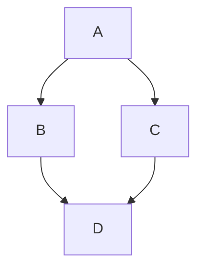
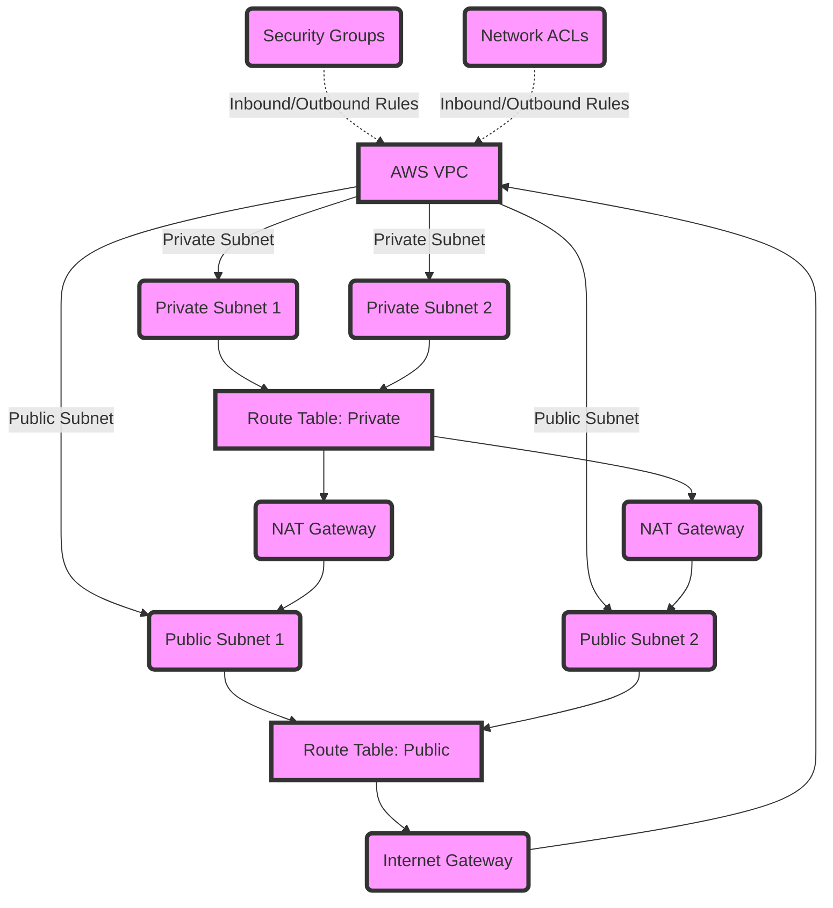
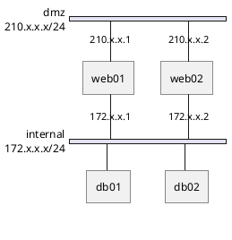

# openstack-in-a-nutshell

Documentation and ansible role collection to setup an openstack environment from scratch.

## Usage

Just clone the repo and run

```
vagrant up
```

If your hardware does not fulfill the requirements in config.yml, you can create a config.override.yml to override some of the values.

During the installation, you will be asked several things:

* Install vagrant-hostmanager plugin
* Select the network interface, that is connected to the internet
* Give Root password for the hostmanager plugin

After the installation has finished, you can open the Dashboard

* http://controller.os.lokal/horizon/

Login:

* admin
* qwertz

## Useful links and

* [Running OpenStack in Production](https://www.youtube.com/watch?v=wsy9OY-ot7E)
* Installing a Minimal Openstack from scratch
  * [Keystone](https://www.youtube.com/watch?v=mCiyTsMvnko)
  * [Glance](https://www.youtube.com/watch?v=UvgMak7DQ9Q)
  * [Horizon and Cinder](https://www.youtube.com/watch?v=sOm6nha-6aQ)
  * [Placement and Nova](https://www.youtube.com/watch?v=ySTNN9gB-Nw)
  * [Neutron](https://www.youtube.com/watch?v=eLJ26JMmi-U)
  * [Compute node](https://www.youtube.com/watch?v=7AFe6RPWdqg)
  * [Testing the cluster](https://www.youtube.com/watch?v=0iILJ2tYKc8)
* Installing Ceph (for later improvement of the Blockstorage Component)
  * [Ceph Cluster Backbone](https://www.youtube.com/watch?v=LxDQyFWDNHI)
  * [Ceph Add OSDs](https://www.youtube.com/watch?v=JLBflREMs2k)
* OpenStack Documentations
  * [Hardware Requirements](https://docs.openstack.org/install-guide/overview.html)
  * [Network self-service](https://docs.openstack.org/install-guide/launch-instance-networks-selfservice.html)
  * [Minimal Installation guide](https://docs.openstack.org/install-guide/openstack-services.html)
  * [Minimal Installation Prerequesites](https://docs.openstack.org/de/install-guide/environment-packages-ubuntu.html)
  * [Full Installation guide](https://docs.openstack.org/install-guide/index.html)
  * [openstack client](https://docs.openstack.org/python-openstackclient/2024.1/)
  * [A guide to applications on openstack](https://www.openstack.org/use-cases/enterprise/)
  * [High Availability](https://docs.openstack.org/arch-design/arch-requirements/arch-requirements-ha.html)
  * [Software and Components overview](https://www.openstack.org/software/)

## Network





```plantuml {align="center"}
Alice -> Bob: Authentication Request
Bob --> Alice: Authentication Response

Alice -> Bob: Another authentication Request
Alice <-- Bob: Another authentication Response
```



The simple [Host Networking](https://docs.openstack.org/install-guide/environment-networking.html) Stack is chosen, which consists of a management and a provider network. There are two options available, provider network and self-service network. The ansible role, installing neutron, is configured to deploy the self-service network option.

The vagrant machine emulates these two networks the following way:

* 1 x Controller Node
  * 1 x management network device - private_network (10.0.0.11)
  * 1 x provider network device - public_network (dhcp)
* 1 x Compute Node
  * 1 x management network device - private_network (10.0.0.21)
  * 1 x provider network device - public_network (dhcp)

The self-service network options requires to link the provider network interface to a bridge and then route all traffic over that bridge, instead of the interface.

Please read the Vagrantfile, to figure out, how this is done.

## Nodes

* https://docs.openstack.org/install-guide/openstack-services.html

### Controller

#### Dependencies

* MariaDB
* RabbitMQ
* Memcache
* Etcd
* Chrony

* https://docs.openstack.org/de/install-guide/environment-packages-ubuntu.html
* https://docs.openstack.org/install-guide/environment-ntp.html

Also add an openstack admin user and configuration for convenience (not recommended on production systems).

#### Keystone

Installing Keystone - the OpenStack Identity Service

* https://docs.openstack.org/keystone/2024.1/install/index-ubuntu.html

##### Test

Set your openstack cli environment variables properly

```
export OS_USERNAME=admin
export OS_PASSWORD=qwertz
export OS_PROJECT_NAME=admin
export OS_USER_DOMAIN_NAME=Default
export OS_AUTH_URL=http://controller:5000/v3
export OS_IDENTITY_API_VERSION=3
export OS_IMAGE_API_VERSION=2
```

Cheat Sheet

```
openstack command list
openstack catalog list
openstack catalog show keystone
openstack configuration show
openstack versions show
openstack service list
openstack service show keystone
```

General resources overview

```
openstack project list
openstack domain list
openstack user list
openstack quota list --compute
openstack quota list --volume
openstack quota list --network
```

Create project for services

```
openstack project create --domain default --description "Service Project" service
```

Create demo project

```
openstack project create --domain default --description "Demo Project" demo
```

Create a user "demo" for the demo project

```
openstack user create --domain default --password-prompt demo
```

Create the "user" role

```
openstack role create user
```

Put all together

```
openstack role add --project demo --user demo user
```

#### glance

Install glance - the OpenStack Image Service

* https://docs.openstack.org/glance/latest/install/install-ubuntu.html

##### Test

Set your openstack cli environment variables properly

```
export OS_USERNAME=admin
export OS_PASSWORD=qwertz
export OS_PROJECT_NAME=admin
export OS_USER_DOMAIN_NAME=Default
export OS_AUTH_URL=http://controller:5000/v3
export OS_IDENTITY_API_VERSION=3
export OS_IMAGE_API_VERSION=2
```

Download the cirros image

```
wget http://download.cirros-cloud.net/0.4.0/cirros-0.4.0-x86_64-disk.img
```

Upload the cirros image

```
openstack image create --file ./cirros-0.4.0-x86_64-disk.img --disk-format qcow2 --container-format bare --public cirros
```

Verify the image was uploaded

```
openstack image list
```

###### Todo

Following commands are failing currently:

```
glance image-create --name "cirros" --file cirros-0.4.0-x86_64-disk.img --disk-format qcow2 --container-format bare --visibility=public
glance image-list
```

#### placement

Install placement - the OpenStack placement service used to track resource provider inventories and usages

* https://docs.openstack.org/placement/2024.1/install/install-ubuntu.html

##### Test

Set your openstack cli environment variables properly

```
export OS_USERNAME=admin
export OS_PASSWORD=qwertz
export OS_PROJECT_NAME=admin
export OS_USER_DOMAIN_NAME=Default
export OS_AUTH_URL=http://controller:5000/v3
export OS_IDENTITY_API_VERSION=3
export OS_IMAGE_API_VERSION=2
```

Perform status checks - user needs to be in group placement

```
placement-status upgrade check
```

List available resources and traits

```
openstack --os-placement-api-version 1.2 resource class list --sort-column name
openstack --os-placement-api-version 1.6 trait list --sort-column name
```

#### neutron

Install neutron - the OpenStack networking service

* https://docs.openstack.org/neutron/2024.1/install/install-ubuntu.html

The self-service networking option is chosen by default

##### Test

Verify neutron

```
?
```

#### nova

Install nova - the OpenStack compute service

* https://docs.openstack.org/nova/2024.1/install/controller-install-ubuntu.html

##### Test

Verify nova cell0 and cell1 are registered correctly

```
su -s /bin/sh -c "nova-manage cell_v2 list_cells" nova
```

#### cinder

Install cinder - the OpenStack block-storage service

* https://docs.openstack.org/cinder/2024.1/install/index-ubuntu.html

##### Test

Verify cinder

```
?
```

#### horizon

Install horizon - the OpenStack dashboard service

* https://docs.openstack.org/horizon/2024.1/install/install-debian.html

##### Test

Verify horizon

```
?
```

### Compute1

#### Dependencies

* Chrony

* https://docs.openstack.org/install-guide/environment-ntp.html

Also add an openstack admin user and configuration for convenience (not recommended on production systems).

#### neutron

Install neutron - the OpenStack networking service

* https://docs.openstack.org/neutron/2024.1/install/compute-install-ubuntu.html

The self-service networking option is chosen by default

##### Test

Verify neutron

```
?
```

#### nova

Install nova - the OpenStack compute service

* https://docs.openstack.org/nova/2024.1/install/compute-install-ubuntu.html

##### Test

* https://docs.openstack.org/nova/2024.1/install/verify.html

Verify nova cell0 and cell1 are registered correctly

```
su -s /bin/sh -c "nova-manage cell_v2 list_cells" nova
```

### Block1

#### Dependencies

* Chrony

* https://docs.openstack.org/install-guide/environment-ntp.html

Also add an openstack admin user and configuration for convenience (not recommended on production systems).

#### Cinder

* https://docs.openstack.org/cinder/2024.1/install/cinder-storage-install-ubuntu.html

#### Tests

```
?
```

### Object1

@Todo

* https://docs.openstack.org/swift/2024.1/install/
* https://docs.openstack.org/cinder/2024.1/install/cinder-backup-install-ubuntu.html
